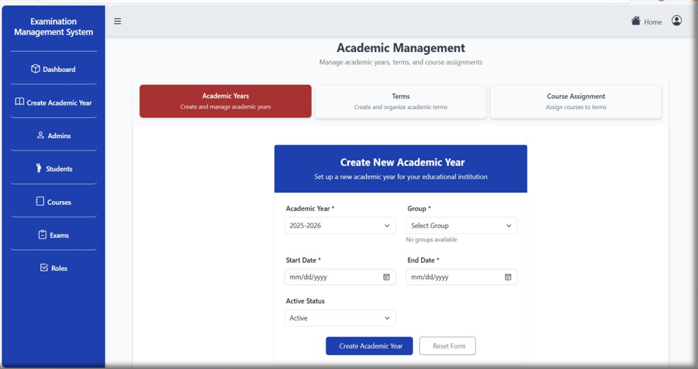
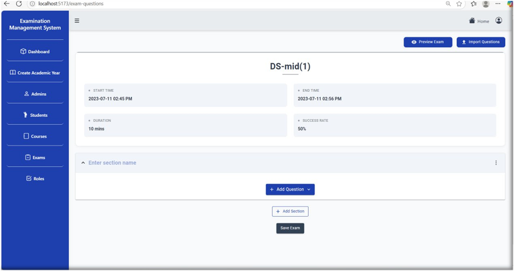
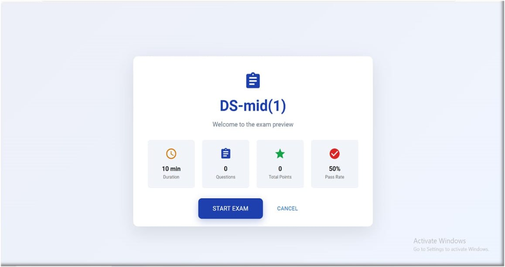
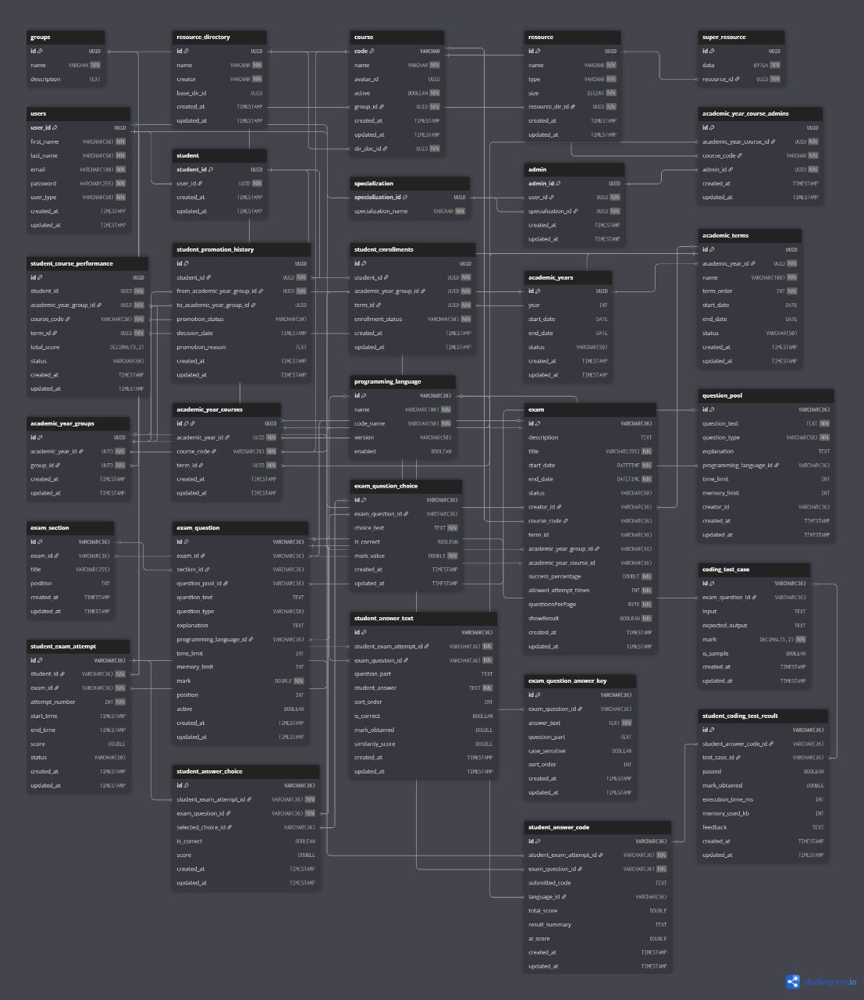

# Integrated Examination-Management-System

The Integrated Examination Management System (IEMS) is a web-based platform designed to digitize and manage the end-to-end process of conducting examinations within academic institutions. The system aims to replace traditional paper-based exams with a reliable, scalable, and secure online solution.
The platform offers the following core functionalities:

1. [ ] Creating and managing academic exams and their schedules
2. [ ] Organizing multiple types of exam questions (e.g., Multiple Choice, Coding, True/False, Matching)
3. [ ] Code Evaluation Engine to support multiple languages such as (Java, Python, C, C++, SQL (MySQL 8.0))
4. [ ] Structuring academic years, terms, and courses with their resources (Images, PDFs, and so on).
5. [ ] Managing user roles (Admin, Professor, Student) and their access rights
6. [ ] Tracking student attempts and displaying their results

The system architecture is based on a three-tier model:
1. [ ] The backend is implemented in Java using the Spring Boot framework, which ensures a robust and modular service layer. It also leverages Spring Data JPA for database interactions and PostgreSQL for persistent data storage.

2. [ ] The frontend is developed using React, providing a dynamic, responsive, and user-friendly interface for all users, including admins, professors, and students.
3. [ ] Communication between frontend and backend is handled through well-defined RESTful APIs, ensuring smooth data exchange and system integration.


### The EMS is modularly designed with clearly separated components, including:
1. [ ] Admin Management
2. [ ] Student Management
3. [ ] Group & Course Management
4. [ ] Academic Year & Term Management
5. [ ] Exam & Question Bank Management








## Full Schema



## SQL

```sql

CREATE TABLE "groups" (
  "id" "UUID" PRIMARY KEY DEFAULT (gen_random_uuid()),
  "name" "VARCHAR" NOT NULL,
  "description" "TEXT"
);

CREATE TABLE "resource_directory" (
  "id" "UUID" PRIMARY KEY DEFAULT (gen_random_uuid()),
  "name" "VARCHAR" NOT NULL,
  "creator" "VARCHAR" NOT NULL,
  "base_dir_id" "UUID",
  "created_at" "TIMESTAMP" DEFAULT (CURRENT_TIMESTAMP),
  "updated_at" "TIMESTAMP" DEFAULT (CURRENT_TIMESTAMP)
);

CREATE TABLE "course" (
  "code" "VARCHAR" PRIMARY KEY,
  "name" "VARCHAR" NOT NULL,
  "avatar_id" "UUID",
  "active" "BOOLEAN" NOT NULL DEFAULT true,
  "group_id" "UUID" NOT NULL,
  "created_at" "TIMESTAMP" DEFAULT (CURRENT_TIMESTAMP),
  "updated_at" "TIMESTAMP" DEFAULT (CURRENT_TIMESTAMP),
  "dir_doc_id" "UUID" NOT NULL
);

CREATE TABLE "resource" (
  "id" "UUID" PRIMARY KEY DEFAULT (gen_random_uuid()),
  "name" "VARCHAR" NOT NULL,
  "type" "VARCHAR" NOT NULL,
  "size" "BIGINT" NOT NULL,
  "resource_dir_id" "UUID" NOT NULL,
  "created_at" "TIMESTAMP" DEFAULT (CURRENT_TIMESTAMP),
  "updated_at" "TIMESTAMP" DEFAULT (CURRENT_TIMESTAMP)
);

CREATE TABLE "super_resource" (
  "id" "UUID" PRIMARY KEY DEFAULT (gen_random_uuid()),
  "data" "BYTEA" NOT NULL,
  "resource_id" "UUID" UNIQUE NOT NULL
);

CREATE TABLE "users" (
  "user_id" "UUID" PRIMARY KEY DEFAULT (gen_random_uuid()),
  "first_name" "VARCHAR(50)" NOT NULL,
  "last_name" "VARCHAR(50)" NOT NULL,
  "email" "VARCHAR(100)" UNIQUE NOT NULL,
  "password" "VARCHAR(255)" NOT NULL,
  "user_type" "VARCHAR(50)" NOT NULL,
  "created_at" "TIMESTAMP" DEFAULT (CURRENT_TIMESTAMP),
  "updated_at" "TIMESTAMP" DEFAULT (CURRENT_TIMESTAMP)
);

CREATE TABLE "student" (
  "student_id" "UUID" PRIMARY KEY DEFAULT (gen_random_uuid()),
  "user_id" "UUID" UNIQUE NOT NULL,
  "created_at" "TIMESTAMP" DEFAULT (CURRENT_TIMESTAMP),
  "updated_at" "TIMESTAMP" DEFAULT (CURRENT_TIMESTAMP)
);

CREATE TABLE "specialization" (
  "specialization_id" "UUID" PRIMARY KEY DEFAULT (gen_random_uuid()),
  "specialization_name" "VARCHAR" NOT NULL
);

CREATE TABLE "admin" (
  "admin_id" "UUID" PRIMARY KEY DEFAULT (gen_random_uuid()),
  "user_id" "UUID" UNIQUE NOT NULL,
  "specialization_id" "UUID" UNIQUE NOT NULL,
  "created_at" "TIMESTAMP" DEFAULT (CURRENT_TIMESTAMP),
  "updated_at" "TIMESTAMP" DEFAULT (CURRENT_TIMESTAMP)
);

CREATE TABLE "academic_year_course_admins" (
  "id" "UUID" PRIMARY KEY DEFAULT (gen_random_uuid()),
  "academic_year_course_id" "UUID" NOT NULL,
  "course_code" "VARCHAR" NOT NULL,
  "admin_id" "UUID" NOT NULL,
  "created_at" "TIMESTAMP" DEFAULT (CURRENT_TIMESTAMP),
  "updated_at" "TIMESTAMP" DEFAULT (CURRENT_TIMESTAMP)
);

CREATE TABLE "student_course_performance" (
  "id" "UUID" PRIMARY KEY,
  "student_id" "UUID" NOT NULL,
  "academic_year_group_id" "UUID" NOT NULL,
  "course_code" "VARCHAR(20)" NOT NULL,
  "term_id" "UUID" NOT NULL,
  "total_score" "DECIMAL(5,2)",
  "status" "VARCHAR(50)",
  "created_at" "TIMESTAMP" DEFAULT (CURRENT_TIMESTAMP),
  "updated_at" "TIMESTAMP" DEFAULT (CURRENT_TIMESTAMP)
);

CREATE TABLE "student_promotion_history" (
  "id" "UUID" PRIMARY KEY,
  "student_id" "UUID" NOT NULL,
  "from_academic_year_group_id" "UUID" NOT NULL,
  "to_academic_year_group_id" "UUID",
  "promotion_status" "VARCHAR(50)",
  "decision_date" "TIMESTAMP" DEFAULT (CURRENT_TIMESTAMP),
  "promotion_reason" "TEXT",
  "created_at" "TIMESTAMP" DEFAULT (CURRENT_TIMESTAMP),
  "updated_at" "TIMESTAMP" DEFAULT (CURRENT_TIMESTAMP)
);

CREATE TABLE "student_enrollments" (
  "id" "UUID" PRIMARY KEY,
  "student_id" "UUID" NOT NULL,
  "academic_year_group_id" "UUID" NOT NULL,
  "term_id" "UUID" NOT NULL,
  "enrollment_status" "VARCHAR(50)" NOT NULL,
  "created_at" "TIMESTAMP" DEFAULT (CURRENT_TIMESTAMP),
  "updated_at" "TIMESTAMP" DEFAULT (CURRENT_TIMESTAMP)
);

CREATE TABLE "academic_years" (
  "id" "UUID" PRIMARY KEY,
  "year" "INT" UNIQUE,
  "start_date" "DATE",
  "end_date" "DATE",
  "status" "VARCHAR(50)",
  "created_at" "TIMESTAMP",
  "updated_at" "TIMESTAMP"
);

CREATE TABLE "academic_terms" (
  "id" "UUID" PRIMARY KEY,
  "academic_year_id" "UUID" NOT NULL,
  "name" "VARCHAR(100)" NOT NULL,
  "term_order" "INT" NOT NULL,
  "start_date" "DATE",
  "end_date" "DATE",
  "status" "VARCHAR(50)",
  "created_at" "TIMESTAMP",
  "updated_at" "TIMESTAMP"
);

CREATE TABLE "academic_year_groups" (
  "id" "UUID" PRIMARY KEY,
  "academic_year_id" "UUID" NOT NULL,
  "group_id" "UUID" NOT NULL,
  "created_at" "TIMESTAMP",
  "updated_at" "TIMESTAMP"
);

CREATE TABLE "academic_year_courses" (
  "id" "UUID" PRIMARY KEY,
  "academic_year_id" "UUID" NOT NULL,
  "course_code" "VARCHAR(20)" NOT NULL,
  "term_id" "UUID" NOT NULL,
  "created_at" "TIMESTAMP",
  "updated_at" "TIMESTAMP"
);

CREATE TABLE "programming_language" (
  "id" "VARCHAR(36)" PRIMARY KEY,
  "name" "VARCHAR(100)" NOT NULL,
  "code_name" "VARCHAR(50)" NOT NULL,
  "version" "VARCHAR(50)",
  "enabled" "BOOLEAN" DEFAULT true
);

CREATE TABLE "exam" (
  "id" "VARCHAR(36)" PRIMARY KEY,
  "description" "TEXT",
  "title" "VARCHAR(255)" NOT NULL,
  "start_date" "DATETIME" NOT NULL,
  "end_date" "DATETIME" NOT NULL,
  "status" "VARCHAR(50)",
  "creator_id" "VARCHAR(36)",
  "course_code" "VARCHAR(36)",
  "term_id" "VARCHAR(36)",
  "academic_year_group_id" "VARCHAR(36)",
  "academic_year_course_id" "VARCHAR(36)",
  "success_percentage" "DOUBLE" NOT NULL,
  "allowed_attempt_times" "INT" NOT NULL DEFAULT 1,
  "questionsPerPage" "BYTE" NOT NULL,
  "showResult" "BOOLEAN" NOT NULL,
  "created_at" "TIMESTAMP",
  "updated_at" "TIMESTAMP"
);

CREATE TABLE "question_pool" (
  "id" "VARCHAR(36)" PRIMARY KEY,
  "question_text" "TEXT" NOT NULL,
  "question_type" "VARCHAR(50)" NOT NULL,
  "explanation" "TEXT",
  "programming_language_id" "VARCHAR(36)",
  "time_limit" "INT",
  "memory_limit" "INT",
  "creator_id" "VARCHAR(36)",
  "created_at" "TIMESTAMP",
  "updated_at" "TIMESTAMP"
);

CREATE TABLE "exam_section" (
  "id" "VARCHAR(36)" PRIMARY KEY,
  "exam_id" "VARCHAR(36)",
  "title" "VARCHAR(255)",
  "position" "INT",
  "created_at" "TIMESTAMP",
  "updated_at" "TIMESTAMP"
);

CREATE TABLE "exam_question" (
  "id" "VARCHAR(36)" PRIMARY KEY,
  "exam_id" "VARCHAR(36)",
  "section_id" "VARCHAR(36)",
  "question_pool_id" "VARCHAR(36)",
  "question_text" "TEXT",
  "question_type" "VARCHAR(50)",
  "explanation" "TEXT",
  "programming_language_id" "VARCHAR(36)",
  "time_limit" "INT",
  "memory_limit" "INT",
  "mark" "DOUBLE" NOT NULL,
  "position" "INT",
  "active" "BOOLEAN",
  "created_at" "TIMESTAMP",
  "updated_at" "TIMESTAMP"
);

CREATE TABLE "exam_question_choice" (
  "id" "VARCHAR(36)" PRIMARY KEY,
  "exam_question_id" "VARCHAR(36)",
  "choice_text" "TEXT" NOT NULL,
  "is_correct" "BOOLEAN",
  "mark_value" "DOUBLE" NOT NULL,
  "created_at" "TIMESTAMP",
  "updated_at" "TIMESTAMP"
);

CREATE TABLE "exam_question_answer_key" (
  "id" "VARCHAR(36)" PRIMARY KEY,
  "exam_question_id" "VARCHAR(36)",
  "answer_text" "TEXT" NOT NULL,
  "question_part" "TEXT",
  "case_sensitive" "BOOLEAN" DEFAULT false,
  "sort_order" "INT" DEFAULT 1,
  "created_at" "TIMESTAMP",
  "updated_at" "TIMESTAMP"
);

CREATE TABLE "coding_test_case" (
  "id" "VARCHAR(36)" PRIMARY KEY,
  "exam_question_id" "VARCHAR(36)",
  "input" "TEXT",
  "expected_output" "TEXT",
  "mark" "DECIMAL(5,2)" NOT NULL,
  "is_sample" "BOOLEAN" DEFAULT false,
  "created_at" "TIMESTAMP",
  "updated_at" "TIMESTAMP"
);

CREATE TABLE "student_exam_attempt" (
  "id" "VARCHAR(36)" PRIMARY KEY,
  "student_id" "VARCHAR(36)" NOT NULL,
  "exam_id" "VARCHAR(36)" NOT NULL,
  "attempt_number" "INT" NOT NULL,
  "start_time" "TIMESTAMP",
  "end_time" "TIMESTAMP",
  "score" "DOUBLE",
  "status" "VARCHAR(50)",
  "created_at" "TIMESTAMP",
  "updated_at" "TIMESTAMP"
);

CREATE TABLE "student_answer_choice" (
  "id" "VARCHAR(36)" PRIMARY KEY,
  "student_exam_attempt_id" "VARCHAR(36)" NOT NULL,
  "exam_question_id" "VARCHAR(36)" NOT NULL,
  "selected_choice_id" "VARCHAR(36)",
  "is_correct" "BOOLEAN",
  "score" "DOUBLE",
  "created_at" "TIMESTAMP",
  "updated_at" "TIMESTAMP"
);

CREATE TABLE "student_answer_text" (
  "id" "VARCHAR(36)" PRIMARY KEY,
  "student_exam_attempt_id" "VARCHAR(36)" NOT NULL,
  "exam_question_id" "VARCHAR(36)" NOT NULL,
  "question_part" "TEXT",
  "student_answer" "TEXT" NOT NULL,
  "sort_order" "INT",
  "is_correct" "BOOLEAN",
  "mark_obtained" "DOUBLE",
  "similarity_score" "DOUBLE",
  "created_at" "TIMESTAMP",
  "updated_at" "TIMESTAMP"
);

CREATE TABLE "student_answer_code" (
  "id" "VARCHAR(36)" PRIMARY KEY,
  "student_exam_attempt_id" "VARCHAR(36)" NOT NULL,
  "exam_question_id" "VARCHAR(36)" NOT NULL,
  "submitted_code" "TEXT",
  "language_id" "VARCHAR(36)",
  "total_score" "DOUBLE",
  "result_summary" "TEXT",
  "ai_score" "DOUBLE",
  "created_at" "TIMESTAMP",
  "updated_at" "TIMESTAMP"
);

CREATE TABLE "student_coding_test_result" (
  "id" "VARCHAR(36)" PRIMARY KEY,
  "student_answer_code_id" "VARCHAR(36)",
  "test_case_id" "VARCHAR(36)",
  "passed" "BOOLEAN",
  "mark_obtained" "DOUBLE",
  "execution_time_ms" "INT",
  "memory_used_kb" "INT",
  "feedback" "TEXT",
  "created_at" "TIMESTAMP",
  "updated_at" "TIMESTAMP"
);

CREATE UNIQUE INDEX ON "student_course_performance" ("student_id", "academic_year_group_id", "course_code", "term_id");

CREATE UNIQUE INDEX ON "student_enrollments" ("student_id", "academic_year_group_id", "term_id");

CREATE UNIQUE INDEX ON "academic_terms" ("academic_year_id", "term_order");

ALTER TABLE "exam_question" ADD CONSTRAINT "fk_exam" FOREIGN KEY ("exam_id") REFERENCES "exam" ("id");

ALTER TABLE "academic_year_courses" ADD CONSTRAINT "fk_exam_year_course" FOREIGN KEY ("id") REFERENCES "exam" ("academic_year_course_id");

ALTER TABLE "exam_question" ADD CONSTRAINT "fk_section" FOREIGN KEY ("section_id") REFERENCES "exam_section" ("id");

ALTER TABLE "exam_question" ADD CONSTRAINT "fk_qpool" FOREIGN KEY ("question_pool_id") REFERENCES "question_pool" ("id");

ALTER TABLE "exam_question" ADD CONSTRAINT "fk_lang" FOREIGN KEY ("programming_language_id") REFERENCES "programming_language" ("id");

ALTER TABLE "exam_question_choice" ADD CONSTRAINT "fk_choice_q" FOREIGN KEY ("exam_question_id") REFERENCES "exam_question" ("id");

ALTER TABLE "exam_question_answer_key" ADD CONSTRAINT "fk_answer_q" FOREIGN KEY ("exam_question_id") REFERENCES "exam_question" ("id");

ALTER TABLE "coding_test_case" ADD CONSTRAINT "fk_tc_question" FOREIGN KEY ("exam_question_id") REFERENCES "exam_question" ("id");

ALTER TABLE "student_exam_attempt" ADD CONSTRAINT "fk_sea_student" FOREIGN KEY ("student_id") REFERENCES "users" ("user_id");

ALTER TABLE "student_exam_attempt" ADD CONSTRAINT "fk_sea_exam" FOREIGN KEY ("exam_id") REFERENCES "exam" ("id");

ALTER TABLE "student_answer_choice" ADD CONSTRAINT "fk_sac_attempt" FOREIGN KEY ("student_exam_attempt_id") REFERENCES "student_exam_attempt" ("id");

ALTER TABLE "student_answer_choice" ADD CONSTRAINT "fk_sac_question" FOREIGN KEY ("exam_question_id") REFERENCES "exam_question" ("id");

ALTER TABLE "student_answer_choice" ADD CONSTRAINT "fk_sac_choice" FOREIGN KEY ("selected_choice_id") REFERENCES "exam_question_choice" ("id");

ALTER TABLE "student_answer_text" ADD CONSTRAINT "fk_sat_attempt" FOREIGN KEY ("student_exam_attempt_id") REFERENCES "student_exam_attempt" ("id");

ALTER TABLE "student_answer_text" ADD CONSTRAINT "fk_sat_question" FOREIGN KEY ("exam_question_id") REFERENCES "exam_question" ("id");

ALTER TABLE "student_answer_code" ADD CONSTRAINT "fk_sacode_attempt" FOREIGN KEY ("student_exam_attempt_id") REFERENCES "student_exam_attempt" ("id");

ALTER TABLE "student_answer_code" ADD CONSTRAINT "fk_sacode_question" FOREIGN KEY ("exam_question_id") REFERENCES "exam_question" ("id");

ALTER TABLE "student_answer_code" ADD CONSTRAINT "fk_sacode_lang" FOREIGN KEY ("language_id") REFERENCES "programming_language" ("id");

ALTER TABLE "student_coding_test_result" ADD CONSTRAINT "fk_sctr_code" FOREIGN KEY ("student_answer_code_id") REFERENCES "student_answer_code" ("id");

ALTER TABLE "student_coding_test_result" ADD CONSTRAINT "fk_sctr_tc" FOREIGN KEY ("test_case_id") REFERENCES "coding_test_case" ("id");

ALTER TABLE "course" ADD FOREIGN KEY ("group_id") REFERENCES "groups" ("id");

ALTER TABLE "course" ADD FOREIGN KEY ("dir_doc_id") REFERENCES "resource_directory" ("id") ON DELETE CASCADE;

ALTER TABLE "resource" ADD FOREIGN KEY ("resource_dir_id") REFERENCES "resource_directory" ("id");

ALTER TABLE "super_resource" ADD FOREIGN KEY ("resource_id") REFERENCES "resource" ("id");

ALTER TABLE "student" ADD FOREIGN KEY ("user_id") REFERENCES "users" ("user_id");

ALTER TABLE "admin" ADD FOREIGN KEY ("user_id") REFERENCES "users" ("user_id");

ALTER TABLE "admin" ADD FOREIGN KEY ("specialization_id") REFERENCES "specialization" ("specialization_id");

ALTER TABLE "academic_year_course_admins" ADD FOREIGN KEY ("academic_year_course_id") REFERENCES "academic_year_courses" ("id");

ALTER TABLE "academic_year_course_admins" ADD FOREIGN KEY ("course_code") REFERENCES "course" ("code");

ALTER TABLE "academic_year_course_admins" ADD FOREIGN KEY ("admin_id") REFERENCES "admin" ("admin_id");

ALTER TABLE "student_course_performance" ADD FOREIGN KEY ("academic_year_group_id") REFERENCES "academic_year_groups" ("id");

ALTER TABLE "student_course_performance" ADD FOREIGN KEY ("course_code") REFERENCES "course" ("code");

ALTER TABLE "student_course_performance" ADD FOREIGN KEY ("term_id") REFERENCES "academic_terms" ("id");

ALTER TABLE "student_promotion_history" ADD FOREIGN KEY ("student_id") REFERENCES "student" ("student_id");

ALTER TABLE "student_promotion_history" ADD FOREIGN KEY ("from_academic_year_group_id") REFERENCES "academic_year_groups" ("id");

ALTER TABLE "student_promotion_history" ADD FOREIGN KEY ("to_academic_year_group_id") REFERENCES "academic_year_groups" ("id");

ALTER TABLE "student_enrollments" ADD FOREIGN KEY ("student_id") REFERENCES "student" ("student_id");

ALTER TABLE "student_enrollments" ADD FOREIGN KEY ("academic_year_group_id") REFERENCES "academic_year_groups" ("id");

ALTER TABLE "student_enrollments" ADD FOREIGN KEY ("term_id") REFERENCES "academic_terms" ("id");

ALTER TABLE "academic_terms" ADD FOREIGN KEY ("academic_year_id") REFERENCES "academic_years" ("id");

ALTER TABLE "academic_year_groups" ADD FOREIGN KEY ("academic_year_id") REFERENCES "academic_years" ("id");

ALTER TABLE "academic_year_groups" ADD FOREIGN KEY ("group_id") REFERENCES "groups" ("id");

ALTER TABLE "academic_year_courses" ADD FOREIGN KEY ("academic_year_id") REFERENCES "academic_years" ("id");

ALTER TABLE "academic_year_courses" ADD FOREIGN KEY ("course_code") REFERENCES "course" ("code");

ALTER TABLE "academic_year_courses" ADD FOREIGN KEY ("term_id") REFERENCES "academic_terms" ("id");

ALTER TABLE "exam" ADD CONSTRAINT "fk_ex_admin" FOREIGN KEY ("creator_id") REFERENCES "users" ("user_id");

ALTER TABLE "exam" ADD CONSTRAINT "fk_ex_course" FOREIGN KEY ("course_code") REFERENCES "course" ("code");

ALTER TABLE "exam" ADD CONSTRAINT "fk_ex_term" FOREIGN KEY ("creator_id") REFERENCES "academic_terms" ("id");

ALTER TABLE "exam" ADD CONSTRAINT "fk_ex_year" FOREIGN KEY ("academic_year_group_id") REFERENCES "academic_year_groups" ("id");

ALTER TABLE "question_pool" ADD CONSTRAINT "fk_qp_lang" FOREIGN KEY ("programming_language_id") REFERENCES "programming_language" ("id");

ALTER TABLE "exam_section" ADD CONSTRAINT "fk_section_exam" FOREIGN KEY ("exam_id") REFERENCES "exam" ("id");


```
<hr>
